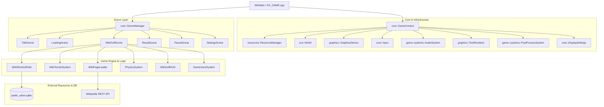

# WikiGOLF プロジェクト詳細ドキュメント (.Agents/README.md)

本ドキュメントは、**WikiGOLF (DX_GAME)** プロジェクトの全体構造、設計思想、モジュール詳細、ビルド手順、テスト手法、およびAIエージェントが開発・改修・保守を行う際の規約とガイドラインをまとめた技術仕様書です。

---

## 目次

1. [プロジェクト概要](#1-プロジェクト概要)
2. [アーキテクチャ概要](#2-アーキテクチャ概要)
3. [ディレクトリ構成](#3-ディレクトリ構成)
4. [主要サブシステム詳細](#4-主要サブシステム詳細)
   - [4.1 コア基盤 (Core & ECS)](#41-コア基盤-core--ecs)
   - [4.2 Wikipedia連携 & 地形生成 (Wiki & Terrain Engine)](#42-wikipedia連携--地形生成-wiki--terrain-engine)
   - [4.3 ゴルフゲームプレイ (Golf Gameplay Engine)](#43-ゴルフゲームプレイ-golf-gameplay-engine)
   - [4.4 物理 & 弾道シミュレーション (Physics & Simulation)](#44-物理--弾道シミュレーション-physics--simulation)
   - [4.5 グラフィックス & レンダリング (Graphics & Rendering)](#45-グラフィックス--レンダリング-graphics--rendering)
   - [4.6 オーディオ & 演出 (Audio & Juice)](#46-オーディオ--演出-audio--juice)
   - [4.7 シーン遷移とライフサイクル (Scene Lifecycle)](#47-シーン遷移とライフサイクル-scene-lifecycle)
5. [ビルド & 開発環境](#5-ビルド--開発環境)
6. [テスト & 検証ツール](#6-テスト--検証ツール)
7. [AIエージェント向けコーディング・開発規約](#7-aiエージェント向けコーディング開発規約)

---

## 1. プロジェクト概要

### 1.1 コンセプト
**WikiGOLF** は、日本語版Wikipediaの記事から3Dのゴルフコース（ボックステレイン）を動的に自動生成し、記事本文内のハイパーリンクを「カップ（ホール）」に見立ててプレイする3Dゴルフゲームです。

- **プレイループ**:
  1. **スタート記事**と**ゴール記事**を決定（ランダム選定、手動入力、プリセット）。
  2. 現在の記事のテキスト・画像から3Dフィールドを自動構築。
  3. 各ハイパーリンク地点にカップと旗（ゴールへの最短ホップ数に応じた色・サイズ）を配置。
  4. プレイヤーはゴルフクラブ（1W, 7I, PW, PT）とショットゲージを用いてボールを打つ。
  5. いずれかのカップにボールをカップインさせると、そのリンク先のWikipedia記事へ遷移し、新たなコースが生成される。
  6. 最小の総打数（パーに対するスコア）でゴール記事への到達を目指す。

### 1.2 技術スタック
- **言語**: C++20 (MSVC /utf-8 /Zc:__cplusplus)
- **グラフィックスAPI**: DirectX 11 (Direct3D 11), Direct2D 1.0, DirectWrite, WIC (Windows Imaging Component)
- **シェーダー言語**: HLSL (Vertex Shader, Pixel Shader, PostProcess, Procedural Grass)
- **3Dアセット / モデル**: 自作プロシージャルメッシュ生成 + Assimp 6.0.2 (OBJ/FBXロード)
- **物理エンジン**: 自作物理シミュレータ（ハイトマップ衝突、OBB/AABB、芝転がり摩擦、静止摩擦、傾斜加速、空気抵抗）
- **データベース**: SQLite3 (Amalgamation) - 日本語Wikipediaのリンクグラフ（SDOW: Six Degrees of Wikipedia）を内蔵し、双方向BFSによる最短経路探索を実行
- **ネットワーク**: WinHTTP (Wikipedia REST API / Action API による記事・画像取得)
- **オーディオ**: 自作オーディオシステム (Media Foundation / XAudio2 / winmm)
- **アーキテクチャ**: 自作軽量ECS (Entity Component System) + シーンステートマシン
- **ビルドツール**: CMake 3.20+ (Visual Studio 2022/2026 ターゲット)

---

## 2. アーキテクチャ概要

本プロジェクトは疎結合なモジュール設計を採用しており、共有データコンテキスト `core::GameContext` を介して各システムが協調動作します。



---

## 3. ディレクトリ構成

```
WikiGOLF/
├── .Agents/                       # AIエージェント向けドキュメント・仕様書
│   └── README.md                  # 本仕様書
├── Assets/                        # ゲーム内リソース
│   ├── Fonts/                     # 同梱フォント (Barlow, Mamelon, Kiwi Maru, Share Tech Mono)
│   ├── data/                      # WikipediaリンクグラフDB (jawiki_sdow-001_part*.sqlite)
│   ├── models/                    # 3Dモデル (ピンフラッグ, ゴルフボール, 小物等)
│   ├── shaders/                   # HLSLシェーダー (Terrain, Skybox, Grass, PostProcess, UI)
│   ├── sounds/                    # 効果音 (ショット音, カップイン, 判定音, 歓声, 環境音)
│   ├── textures/                  # 地形マテリアル、スカイボックス、UIテクスチャ
│   └── ui/                        # UIスプライト、アイコン
├── libs/                          # 外部静的/動的ライブラリ
│   └── assimp-6.0.2/              # Open Asset Import Library
├── src/                           # ソースコード
│   ├── audio/                     # オーディオ管理 (AudioSystem, AudioClip)
│   ├── core/                      # コア基盤 (GameContext, Input, DisplaySettings, Profiler, Logger)
│   ├── ecs/                       # 軽量ECS (World, Entity, ComponentPool, Pipeline, View)
│   ├── game/                      # ゲーム固有ロジック
│   │   ├── components/            # ECSコンポーネント (GolfGameState, Camera, Transform, UI等)
│   │   ├── controllers/           # ゲーム内コントローラ (Shot, Club, Camera, Minimap, HUD)
│   │   ├── scenes/                # シーン実装 (Title, Loading, WikiGolf, Result, Pause, Settings)
│   │   ├── systems/               # ECSシステム (Terrain, Physics, Render, Juice, ShortestPath)
│   │   └── utils/                 # 算術・物理・ルール補助関数 (TrajectorySimulation, ParRules等)
│   ├── graphics/                  # レンダリング基盤 (GraphicsDevice, Mesh, Shader, TextRenderer)
│   ├── resources/                 # アセット管理 (ResourceManager, Handle管理)
│   ├── thirdparty/                # サードパーティソース (sqlite3 amalgamation)
│   └── pch.h                      # プリコンパイル済みヘッダー
├── tools/                         # 補助ツール (SkyboxGen, WikiImagePreview, dbbuildスクリプト)
├── test_*.cpp                     # ユニットテスト (物理、弾道、地形、UI、ルール等)
├── CMakeLists.txt                 # CMakeビルド定義
└── DX_GAME.cpp                    # エントリポイント (WinMain, ウィンドウプロシージャ)
```

---

## 4. 主要サブシステム詳細

### 4.1 コア基盤 (Core & ECS)
- **`core::GameContext`**:
  リソース、ECSワールド、DirectXデバイス、入力、オーディオ、シーンマネージャー、ディスプレイ設定、ポストプロセス等のポインタをまとめたハブ構造体。すべての更新・描画関数に参照渡しされます。
- **`ecs::World`**:
  スパースセットベースの高速・型安全な自作ECS。
  - エンティティID: 32bit (20bit Index + 12bit Generation)。
  - クエリ: `world.Query<Transform, MeshRenderer>().Each([](Entity e, Transform& t, MeshRenderer& r) { ... });`
- **`core::DisplaySettings`**:
  解像度、ウィンドウモード（ウィンドウ、ボーダーレス、排他フルスクリーン）、GPUアダプタ選択、MSAA (1x/2x/4x/8x)、FXAA、レンダースケール (50%〜200%)、VSync、FPS上限の管理と `display_settings.ini` への永続化を担当。
- **`core::Profiler`**:
  CPUスコープ計測 (`PROFILE_SCOPE`) およびDirectX 11タイムスタンプクエリによるGPUプロファイリング (`ScopedGpuTimer`)。終了時にCSV出力が可能。

### 4.2 Wikipedia連携 & 地形生成 (Wiki & Terrain Engine)
- **`game::systems::WikiClient`**:
  WinHTTPを利用してWikipedia API (`ja.wikipedia.org`) と非同期通信。記事本文、見出し、内部リンク一覧、代表画像・サムネイル画像を安全にパース・取得。
- **`graphics::WikiTextureGenerator`**:
  Direct2D / DirectWrite を駆使し、記事タイトル・段落・画像・リンクを看板テクスチャとしてオフスクリーン描画。リンクテキストの描画位置（UV矩形バウンディングボックス）を検出し、3Dワールド座標への逆変換マッピングを生成。
- **`game::systems::WikiTerrainSystem` & `TerrainGenerator`**:
  記事の文字数、段落構成、画像位置に応じてハイトマップとマテリアルマップ（Fairway, Rough, Bunker, Green, Ice, Water, Lava, Stone）を動的生成。
  - **インクリメンタルビルド**: 画面フリーズを防ぐため、`std::async` で地形データを事前計算し、メインスレッド上でフレームごとに1タイルずつメッシュ化 (`StepBuildField`)。
  - **動的プロシージャル芝**: ラフおよびフェアウェイ上に千鳥配置で高密度の草パッチメッシュをインスタンシング配置。ボール通過時のなぎ倒し物理インタラクション (`UpdateSurfaceResponse`) をHLSL (`GrassVS.hlsl`) 経由で実行。
- **`game::systems::WikiShortestPath`**:
  jawikiリンクグラフDB (`Assets/data/jawiki_sdow-001.sqlite`) に対し、双方向幅優先探索（Bidirectional BFS）を実行。現在地からゴール記事までの最短ホップ数をリアルタイムに算出。
  - 記事内の全リンクについてゴールまでの残りホップ数を一括計算し、ホールの旗（ゴール直通、1ホップ、2ホップ等）の配色・大型化に反映。

### 4.3 ゴルフゲームプレイ (Golf Gameplay Engine)
- **`game::scenes::WikiGolfScene`**:
  ゴルフゲームの中心となるシーン。打球、移動、カップイン、カメラ遷移、演出等の全状態を統括。
- **`game::controllers::ShotController` & `game::utils::ShotGaugeRules`**:
  みんなのゴルフライクな3クリック式ショットゲージ。
  1. 第1クリック: ゲージ始動
  2. 第2クリック: パワー（飛距離）の決定
  3. 第3クリック: インパクトゾーンでのタイミング合わせ
  - タイミング精度により判定 (`Special`, `Great`, `Nice`, `Miss`) を下し、スピン量や左右のブレ角を決定。
- **`game::controllers::ClubController` & `game::utils::CarryDistanceTable`**:
  番手管理（1W / 7I / PW / PT）。番手ごとにロフト角、最大初速、反発係数が定義され、事前計算されたキャリーテーブル (`LookupSpeedForDistance`) に基づいて弾道を決定。
- **`game::controllers::MinimapController`**:
  コース全体を上空から描画するトップビュー機能。オフスクリーンレンダーターゲットを用いてミニマップおよび全画面マップ表示、着弾点予測サークルの描画を制御。
- **`game::controllers::WikiGolfHUD`**:
  ブラウザ風アドレスバー（現在記事、目標記事）、風速・風向カード、選択中クラブ情報、打数/パー、打球結果フィードバック（Nice Shot等）を DirectWrite で描画。

### 4.4 物理 & 弾道シミュレーション (Physics & Simulation)
- **`game::systems::PhysicsSystem` & `PhysicsFriction`**:
  固定サブステップ（30FPS〜120FPS相当）で積分を行う物理エンジン。
  - **空中フェーズ**: 重力加速度、空気抵抗、風による外力、バックスピン・サイドスピンによる揚力を計算。
  - **衝突フェーズ**: テレインハイトマップとの精密衝突判定。法線ベクトルに基づく反発計算。
  - **転がり・滑走フェーズ**: 芝マテリアル（Fairway, Rough, Green, Bunker等）に応じた動摩擦係数、微小速度域の静止摩擦判定（斜面滑落防止）、および芝抵抗を考慮。
- **`game::utils::TrajectorySimulation`**:
  打球前に着弾地点を予測するための物理事前計算モジュール。風やクラブ性能、地形の高低差を考慮した放物線を瞬時に予測。
- **`game::scenes::CupInUtils`**:
  ボールのホール内進入判定。ホール中心からの平面距離および速度ベクトルを監視し、ホール内で十分に減速・静止した時点でカップインと判定。

### 4.5 グラフィックス & レンダリング (Graphics & Rendering)
- **`graphics::GraphicsDevice`**:
  Direct3D 11.0 / 11.1 ラッパー。ダブルバッファリング、深度ステンシル、動的ビューポート、MSAA/FXAA/解像度スケーリングの統合管理。
- **`game::systems::RenderSystem`**:
  ECS上の `Transform` と `MeshRenderer` を収集し、不透明・半透明・アルファテストの順に描画。ライティング、影、マテリアルパラメータを定数バッファ経由でHLSLシェーダーへ供給。
- **`game::systems::SkyboxRenderSystem` & `SkyboxTextureGenerator`**:
  記事のカテゴリ（自然、宇宙、歴史、地理等）に応じたプロシージャルスカイボックステクスチャの動的生成とキューブマップ描画。
- **`game::systems::PostProcessSystem`**:
  HDRブルーム、距離線形化フォグ（霧）、トーンマッピング、ビネット、カラーグレーディングを1パスのポストプロセスで適用。
- **`graphics::TextRenderer`**:
  Direct2D / DirectWrite をスワップチェーンバックバッファに直接バインドし、解像度非依存の高品質フォントレンダリングを提供。

### 4.6 オーディオ & 演出 (Audio & Juice)
- **`game::systems::AudioSystem`**:
  BGMおよびSEの多重再生。ボリューム管理、ループ設定、ピッチ調整。
- **`game::systems::GameJuiceSystem`**:
  ゲームの爽快感（Juice）を高める演出統合モジュール。
  - インパクト時のカメラシェイク（振動減衰）
  - ジャストインパクト時のスローモーション（ヒットストップ）
  - カップイン時の紙吹雪・花火パーティクル生成
  - ボール軌跡のトレイル描画

### 4.7 シーン遷移とライフサイクル (Scene Lifecycle)
```
[起動 (DX_GAME.cpp)]
       │
       ▼
[TitleScene] ──(記事選定 / スタート)──► [LoadingScene]
       ▲                                      │
       │                               (非同期データ準備完了)
       │                                      ▼
[ResultScene] ◄──(ゴール到達)─────── [WikiGolfScene] ◄──┐
       │                                   │ │          │ (カップイン遷移)
       └───────(リトライ / タイトル)────────┘ └─── 次記事 ─┘
```
- **`TitleScene`**: 記事の選定、チュートリアル開始、設定画面呼び出し。
- **`LoadingScene`**: 記事ダウンロード、テクスチャ構築、最短経路探索をバックグラウンド実行しつつ進捗描画。
- **`WikiGolfScene`**: ゴルフプレイ本体。カップイン時に `TransitionToPage` を呼び出して次記事へシームレスに移行。
- **`ResultScene`**: ゴール達成時のスコアカード、総打数、パー対比評価（イーグル、バーディ等）、辿った記事の系譜一覧を表示。
- **`PauseScene` / `SettingsScene`**: ゲーム中断と各種グラフィック/オーディオ設定の動的変更。

---

## 5. ビルド & 開発環境

### 5.1 必要要件
- **OS**: Windows 10 / 11 (64-bit)
- **コンパイラ**: MSVC v143 以上 (Visual Studio 2022 / 2026)
- **ビルドツール**: CMake 3.20 以上
- **Windows SDK**: 10.0.22000.0 以上 (DirectX 11, Direct2D, DirectWrite, Media Foundation, WinHTTP 必須)

### 5.2 ビルド手順

```powershell
# 1. ビルドディレクトリの生成 (Visual Studio 2022 / 2026 64-bit)
cmake -B build -G "Visual Studio 17 2022" -A x64

# 2. プロジェクトのビルド (Release構成)
cmake --build build --config Release -j

# 3. データベースの自動結合
# CMakeLists.txt 内の custom_command により、初回ビルド時に
# Assets/data/jawiki_sdow-001_part*.sqlite が結合されて
# jawiki_sdow-001.sqlite が自動生成されます。
```

### 5.3 成果物の配置
- 実行ファイル: `build/Release/DX_GAME.exe`
- ポストビルド処理により、`Assets/` ディレクトリおよび `libs/assimp-6.0.2/assimp-vc143-mt.dll` が自動的に出力ディレクトリへコピーされます。

---

## 6. テスト & 検証ツール

本プロジェクトは `enable_testing()` により CTest と統合された包括的な単体テスト群を備えています。ロジック変更時はこれらのテストを実行してリグレッションを防止してください。

### 6.1 ユニットテスト一覧
- **`test_shot_gauge_rules`**: ショットゲージのインパクト判定境界および表示幅の計算テスト
- **`test_physics_friction`**: 芝フリクション減速、静止摩擦、傾斜滑降判定のテスト
- **`test_trajectory_simulation`**: 弾道予測計算および飛距離-初速テーブル変換の精度テスト
- **`test_terrain_generation`**: ハイトマップ境界、マテリアル配置、障害物生成ロジックのテスト
- **`test_cupin_utils`**: ホール判定のしきい値・静止検知テスト
- **`test_loading_scene_progress`**: ローディング進捗のスムージング・合成ロジックのテスト
- **`test_loading_scene_fade`**: 画面フェード係数計算テスト
- **`test_par_rules`**: リンク数に基づく規定打数（パー）算出テスト
- **`test_page_history_utils`**: ページ履歴スタックの追加・巻き戻しテスト
- **`test_map_view_utils`**: マップビューにおけるカメラ座標・スケール計算テスト
- **`test_string_utils_trim`**: 文字列トリミング・サニタイズテスト
- **`test_ui_image_has_texture`**: UIイメージのテクスチャハンドル整合性テスト
- **`test_graphics_preset`**: 画質プリセット設定の反映テスト
- **`test_logger_warning_output`**: ロガーの出力レベルフィルタテスト

### 6.2 テスト実行方法
```powershell
cd build
ctest -C Release --output-on-failure
```

### 6.3 スタンドアロン検証ツール
- **`WikiImagePreview.exe`**: Wikipedia記事の画像レイアウト・フロート配置を単体でプレビューする検証ツール (`tools/WikiImagePreview.cpp`)。
- **`SkyboxGen.exe`**: スカイボックステクスチャを事前生成・確認するツール (`tools/SkyboxGen.cpp`)。

---

## 7. AIエージェント向けコーディング・開発規約

本プロジェクトでコードの作成、改修、リファクタリングを行うAIエージェントは、以下のルールを**厳格に遵守**してください。

### 7.1 言語とコメント規約
- **プランや解説**: ユーザーとの対話およびプラン提示は**日本語**で行うこと。
- **コード内コメント**:
  - コメントは**Doxygen形式** (`/** ... */` または `///`) で**最小限**のみ記述すること。
  - **コード内に自身の思考過程、試行錯誤の履歴、冗長な日本語解説文を書くことを固く禁止する。**
  - 不必要なTODOや冗長な一行コメントを撒き散らさず、インターフェース仕様を明確にするDoxygenコメントのみを簡潔に付与すること。

### 7.2 設計・実装ガイドライン
1. **DirectX / COMリソースの管理**:
   - COMオブジェクトには必ず `Microsoft::WRL::ComPtr<T>` を使用し、手動の `Release()` 漏れを防ぐこと。
   - スワップチェーンのリサイズ時は、Direct2Dレンダーターゲット (`TextRenderer::ReleaseTargetForResize()`) を先に解放してから `ResizeBuffers` を呼ぶこと。
2. **スレッド安全性と非同期処理**:
   - Wikipedia APIの通信や最短経路探索 (SQLite) は必ずワーカースレッド (`std::async`, `std::jthread`) で非同期に行い、メインスレッドのレンダリングループを決してブロックしないこと。
   - スレッド終了やシーン破棄時には `RequestCancelAll()` 等の中断フラグを正しく処理し、ハングアップを回避すること。
3. **ECSの分離原則**:
   - `components/` には純粋なデータ（POD構造体またはステート）のみを定義し、処理ロジックを持たせないこと。
   - 振る舞いやアルゴリズムは `systems/` または `controllers/` に実装すること。
4. **文字コードとUnicode**:
   - プロジェクト全体で `/utf-8` が有効化されています。日本語文字列は UTF-8 (`std::string`) または Windows API用 UTF-16 (`std::wstring`) を `core::StringUtils` を介して適切に相互変換すること。
5. **テストの併設・更新**:
   - 計算ロジック（物理、ゲージ、パー判定、パス探索等）に変更を加えた場合は、対応する `test_*.cpp` が通ることを確認し、必要に応じてテストケースを追加すること。
